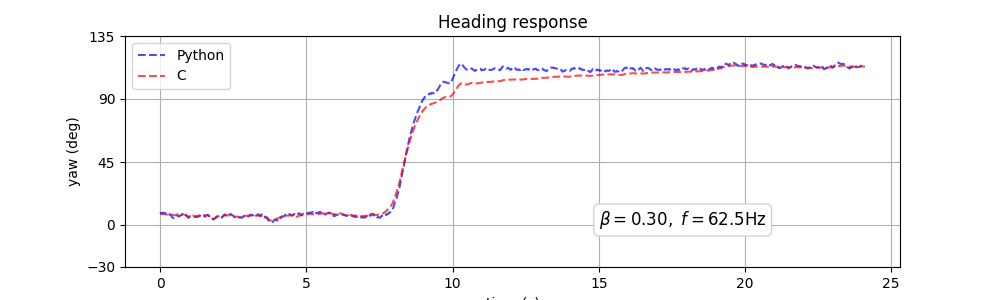

# Madgwick's Filter Implementation Analysis
Exploring how implementations differ, mainly focusing on a bug in the widely used C version of the filter.

## Summary
Madgwick's AHRS algorithm for orientation sensor fusion is a well regarded filter to fuse IMU / MARG sensor data to estimate the sensor's orientation with respect to the earth frame. It is widely used due to its efficiency, stability, and being open source. 

However, the C implementation has a slight bug that results in non-optimal fusion when using the full MARG filter. Specifically, the C version does not seem to agree with the mathematics of the paper or the Matlab implementation, as well as open source Python implementations that are be based on the Matlab code.

## Motivation
I was characterising IMUs and found that on-board processing results differed to post processed results, eventually tracking the difference to parts in the Python and C implementations of the Madgwick filter, leading to this type of graph:

Since both implementations are widely used I was surprised to be able to track it back to the original implementations too. It is important to note that this is not a critique of the algorithm, purely a look at the implementations and what I believe to be a bug in the C version. Madgwick's filter is awesome and works very well, even with the bug.

## Bugs
There are actually two different, unrelated bugs. 

### Normalisation Bug
The first, and less important bug is in the code from the project report describing the filter and is caused by the magnetomer readings being normalised after they are assigned. So it would not be noticeable when calling the function with already normalised data.

This implementation is not very optimised and doesn't appear to be used much outside the report. It is refered here as the "paper version" even though it is also written in C.

I only found it because I wanted to check if the x2 bug also features in the paper. (It does not)
Only [Experiment 4](./experiment_4_mat_vs_c_vs_paper/README.md) uses this implementation and shows the effect of fixing it.

### x2 Bug
The second, more important bug is in the distributed C code. A missing *2 in the magnetic distortion copensation step causes the filter to use a smaller b than intended and consequently behave slightly differently during an AHRS update. The effect of the bug is not constant and it appears that one can compensate for it to some extend by choosing a different Beta. Still, it would be surprising if I were the first to discover it.

This implementation is optimised and code based on it is widely used. I expect most versions based on it have the same issue because the code is copied verbatim. It is refered here as the "C version".

This is the bug most of the "experiments" focus on.

### Code
The code describing the two bugs and fixes is [here](./bug_description.md).

## Proof
The simple test of putting the same data in and getting different quaternion results out is shown in [Experiment 1](./experiment_1_mat_vs_c_org_data/README.md) and [Experiment 2](./experiment_2_mat_vs_c_short_data/README.md). Furthermore, applying the fix to the C implementations causes the outputs to agree with the Matlab version: [Experiment 4](./experiment_4_mat_vs_c_vs_paper/README.md).

## Implementations Tested
A quick overview of implementations tested. They broadly fall into two categories. **"Matlab-style"** are those behaving like the Matlab implementation, without bug. **"C-style"** are those behaving like the C code with the x2 bug.

Please look at the more [detailed description](./madfilters/README.md) for links to sources and changes made for each implementation listed. 

| Implementation                 | x2 Bug | norm Bug | no Bug |
|--------------------------------|:------:|:--------:|:------:|
| Matlab from x-io               |        |          |    x   |
| Python from ahrs package       |        |          |    x   |
| Python, translated from Matlab |        |          |    x   |
| C code from x-io               |   x    |          |        |
| Adafruit's Implementation      |   x    |          |        |
| Arduino's Implementation       |   x    |          |        |
| C code from Paper              |        |     x    |        |
| C code from Paper, with fix    |        |          |    x   |
| C code from Paper, no comp.    |        |          |    x   |
| C code from x-io, with 1/sqrt()|   x    |          |        |
| C code from x-io, with fix     |        |          |    x   |

## Impact
The bug only effects the transient, dynamic response. However, if the compensation involves the choice of a different, non-optimum Beta value, the static performance may also be impacted. The size of the impact varies. It seems to depend on the orientation, sampling frequency, and / or chosen Beta. For example, in our testing, the bug was not detactable when moving the sensor flat around its yaw axis only.

## Compensating with Beta
 [Experiment 7](./experiment_7_beta_fix/README.md) attempts to make a filter with the x2 Bug behave as if it didn't have it by selecting an optimum value of Beta. This can mostly compensate for the bug in the test case but not fully. It is also not clear if that compensation works with different orientations, sample rates, noise, and selected reference Beta as it just optimises for the short test data. The chosen Beta is 5 times larger than the one used in the reference filter without the bug. Repeating the test with different data at a different frequency resulted in an optimum beta that was only ~2 times the original. 

## Mathematical Analysis
Missing the x2 changes the minimisation function as defined in (29). The filter now does the gradient descent with the objective of finding a quaternion that transforms the earth magnetic field `b` into double the the normalised magnetic reading `m`. Of course, a unit quaternion does not change the magnitude of the vector it rotates so one might think that it doesn't matter because the function is still minimised when the resulting vectors are aligned. Clearly that's not what happens but I don't know why.

Following the derivation further, in equation (43) we find

`q_est' = q_w' - Beta * del(f)/mag(del(f))`

The bug only affects `f` so one might conclude that a smaller `Beta` reduces the effect. I don't fully understand the mathematical implications but it must be influencing the gradient descent step. Any help is welcome!

## This Repo
`./madfilters` contains wrapped implementations of the Madgwick filter so they all have a common interface. The C / Cpp filters are interfaced using *Cython*. The Matlab filter requires the user to run a Matlab script in Octave or Matlab which imports and exports data using hdf5 files. See the  [filter readme](./madfilters/README.md) for more.

For installation, `pip install -r requirements.txt` will install the `madfilters` in editable mode as well as required packages. The Cython based packages then need to be build by running `python setup.py` from inside the `cpp` directory. 