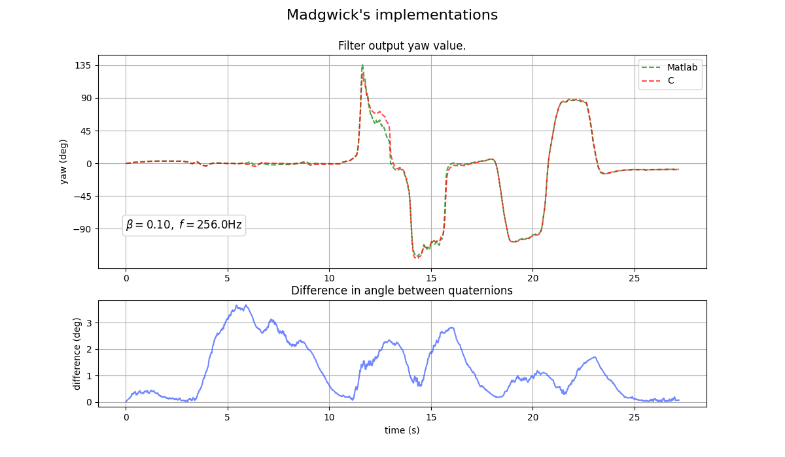

# Exp 1 - X-IO implementation & data

Tests the original filters from the x-io website. Uses the supplied test data at the default beta and sampling frequency. 

## Results
The two filters don't agree. The disagreement is small, ~3 degrees but it's the same math.

## Reproduce
1. Open `madfilters/mat` in Octave / Matlab and run `ExampleDataRun.m` which generates `ExampleData.hdf5`
2. Run `mat_vs_c.py` to generate the graph.