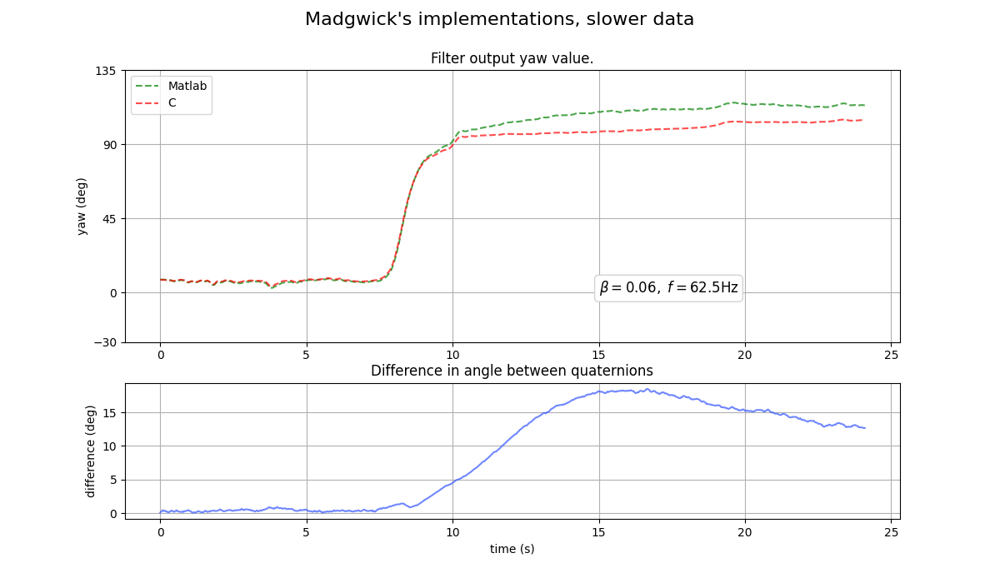

# Exp 2 - X-IO implementation & slower data

Tests the original filters from the x-io website but this time with different, simpler test data.

## Results
The disagreement is much bigger at > 15 degrees and the c filter is slower to approach the final value. 

## Reproduce

- Run `mat_vs_c.py_2` to generate the graph.
- If the beta parameter change, `CustomDataRun.m` needs to be run in Octave / Matlab to regenerate the quaternion data from the matlab filter.