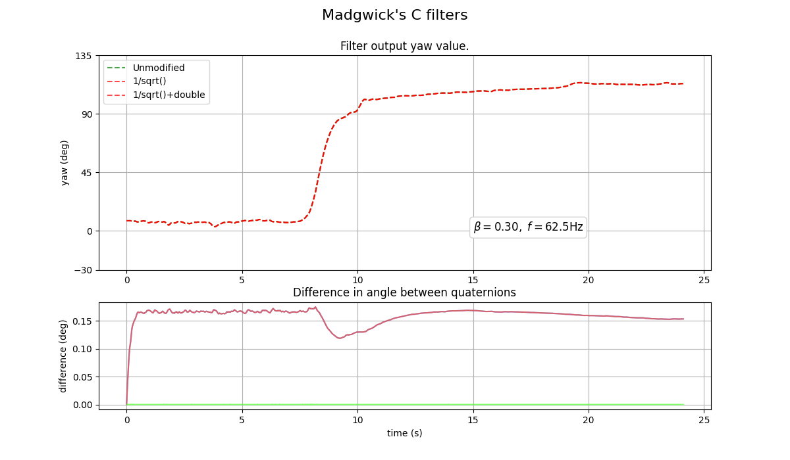

# Exp 3 - Show impact of fast_inv_sqrt() and single point precision

Tests the original filters from the x-io website and variants with `fast_inv_sqrt()` replaced by `1/sqrt()` and
`floats` changed to `double`.

## Results
All three variants very much agree with each other. The `fast_inv_sqrt()` change has a tiny impact and changing to double is not measurable.

## Reproduce

- Run `c_vs_c_vs_c.py` to generate the graph.