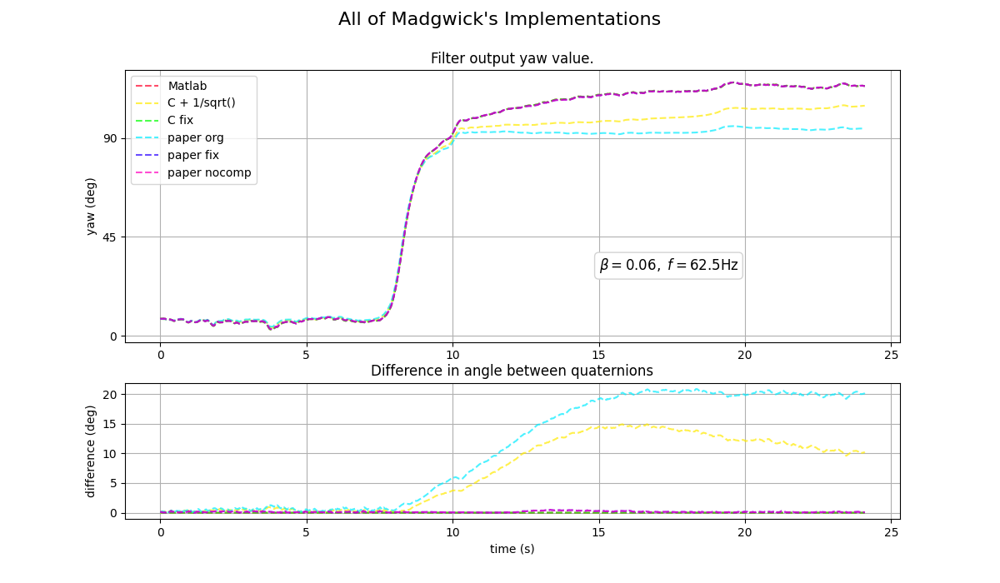

# Exp 4 - Madgwick's implementations

Comparing the Matlab, C version, and C version from the paper. 

## Results
All three variants are different. The version from the paper has a bug which causes magnetometer values to be used before they are normalised. It is therefore only visible non-normalised input data is used. The C version has a different bug where the magnetic field in the earth frame is half the size it should be. 

The figure shows how the original versions don't agree but once the bugs are fixed, the three implementations are the same, except for minor differences on when parameters are calculated and floating point precisions. 

## Reproduce

- Run `mat_vs_paper_vs_c.py`