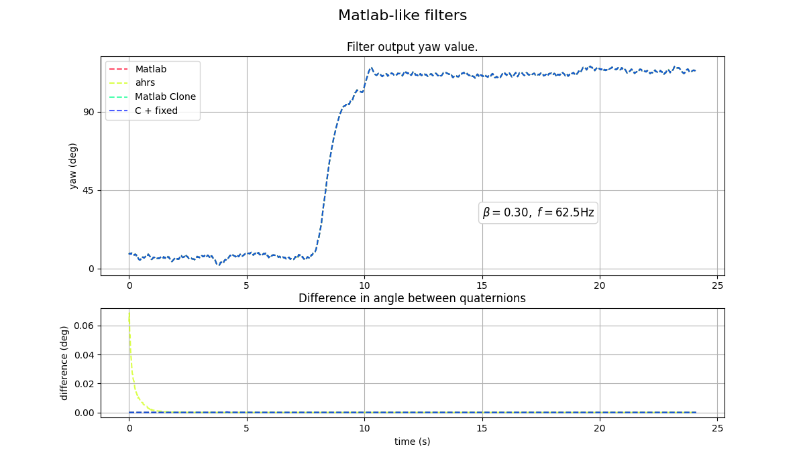

# Exp 5 - Implementations that mirror the Matlab code

Shows that the python packages based on the Matlab code agree with the original Matlab code. More importantly, also shows that applying the x2 fix to the C code makes it behave like the Matlab code.

## Reproduce

- Run `mat_style_filters.py`