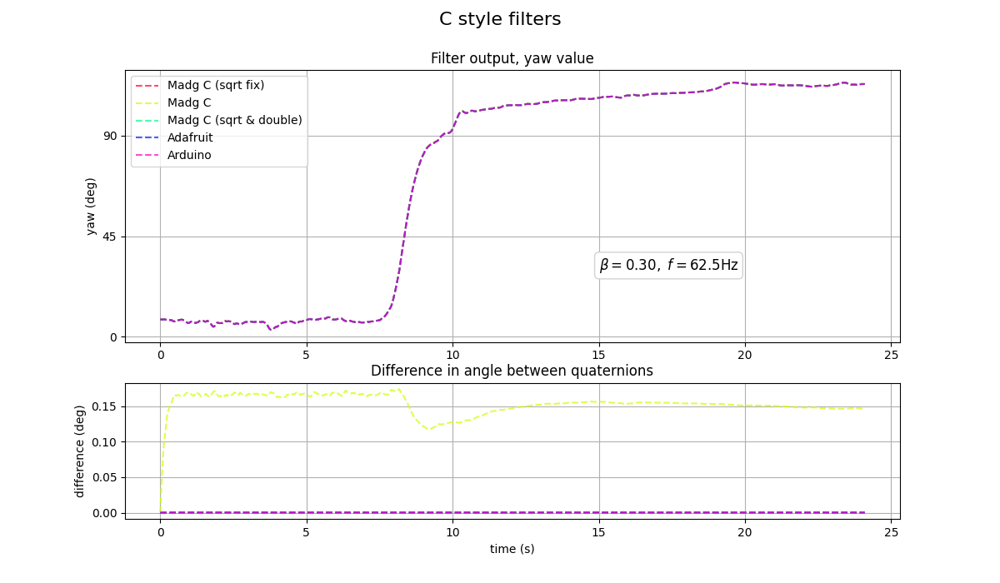

# Exp 6 - Algorithms that are based on the C version.

Just to show that all these algorithms that use the same code also behave the same.

## Results
As expected, they are all the same. Some slight fast_inv_sqrt() implementation differences only.

## Reproduce

- Run `c_style_filters.py`