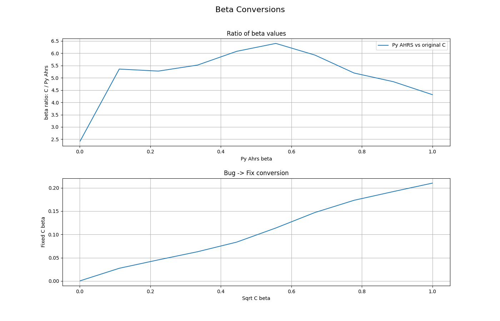

# Exp 7 - Changing Beta

Comparing the two main versions of the filter to determine how the beta parameter changes the effect of the bug.

## Figure 1: Plot several Beta values

This graph shows how different beta values compare with the python version of the filter. With the used test data, the effect of the bug is to reduce the effective beta. When using the same beta value, they take a long time to converge. 

## Figure 2: Finding the "ideal" beta to compensate

Optimising the chosen beta so that the resulting average difference between the two quaternions is minimised shows that the beta that best compensates for the bug is x5 times larger than the beta used in the bug-free filter. Plot 2 shows the average difference over a range of possible betas. It is important to note that this graph may look very different for different data. Ie, it does not not mean this value of beta makes the two filters equivalent.

Plot 3: Even with the best possible beta value chosen, the outputs differ by several degrees.

To show how the beta equivalence does not hold for all data, here are the same two figures with Madgwick's sample data, at 256Hz.

## Figure 3: Converting Beta Values
The choice of 0.1 for beta in the first samples above is pretty arbitrary. What if we change the beta value of the "base filter", in this case the python filter? We can see that over a large range of beta values, the buggy C version's beta is ~5x the python filter. Again, this is for the first dataset!

## Reproduce

- Run `optimise_beta.py` and `beta_conversions.py`
- The base beta value `beta_py` at the top of `optimise_beta` can be easily changed.